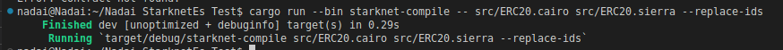
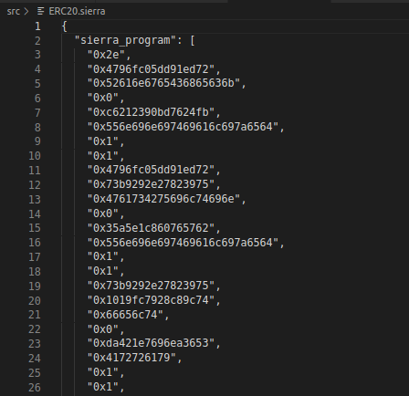
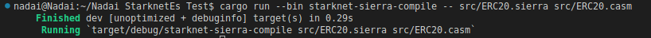
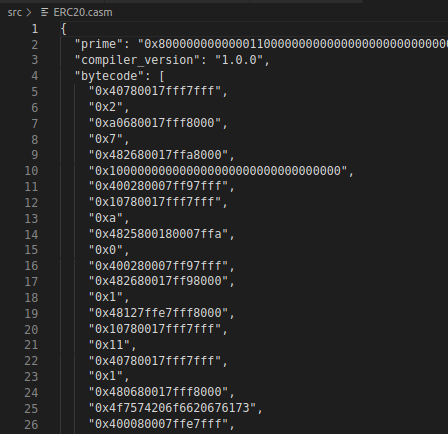
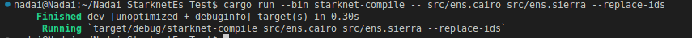
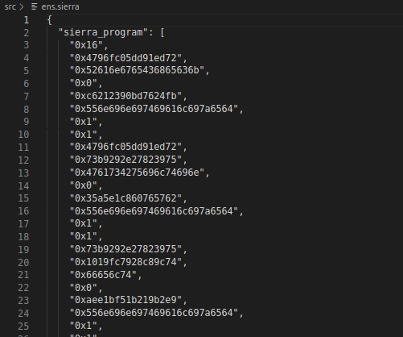
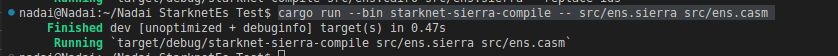
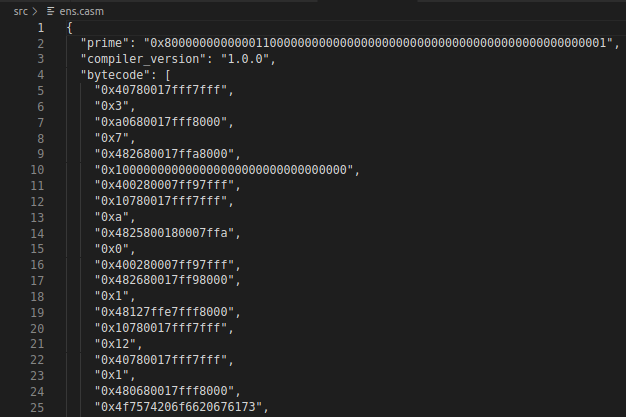

 <div align="center">
  <h1>Cairo 1.0🐺 </h1>
  <h2> ⚡Compilador ⚡ rapidísimo ⚡ para Cairo, escrito en 🦀 Rust. 🦀 </h2>
  <a href="https://github.com/starkware-libs/cairo/issues/new?assignees=&labels=bug&template=01_BUG_REPORT.md&title=bug%3A+">Reportar un Error</a>
  -
  <a href="https://github.com/starkware-libs/cairo/issues/new?assignees=&labels=enhancement&template=02_FEATURE_REQUEST.md&title=feat%3A+">Solicitar una Función</a>
  -
  <a href="https://github.com/starkware-libs/cairo/discussions">Formule una Pregunta</a>
</div>

<div align="center">
<br />

[](https://github.com/starkware-libs/cairo/actions/workflows/ci.yml)
[](LICENSE)
[](https://github.com/starkware-libs/cairo/issues?q=is%3Aissue+is%3Aopen+label%3A%22help+wanted%22)

</div>


---

## Cómo empezar

### Requisitos previos

- Instalar [Rust](https://www.rust-lang.org/tools/install)
- Configurar Rust:
```bash
rustup override set stable && rustup update && cargo test
```

## Empezando con Cairo 1.0
Una vez instalado Rust, clona el repositorio ejecutando el siguiente comando en un terminal:

* [Nadai Oficial](https://github.com/Nadai2010/Nadai-Cairo-1.0-Sierra): `gh repo clone Nadai2010/Nadai-Cairo-1.0-Sierra`A diferencia de los contratos 0.x, donde compilamos directamente a ensamblador Cairo (casm), con Cairo 1.0, la compilación de nuestros contratos se hará en dos etapas:

1. Cairo > Sierra
2. Sierra > Casm

Sierra significa Safe Intermediate Representation (Representación Intermedia Segura) y pretende constituir una capa de representación entre los programas Cairo y sus bytecodes. Sierra abre la posibilidad de probar cada ejecución de Cairo, permitiendo así una robusta protección contra ataques de Denegación de Servicio (DoS).

En este caso nos centraremos en dos contratos, [ERC20.cairo](src/ERC20.cairo) y [ENS.cairo](src/ens.cairo)

### ERC20
Para compilar a Sierra, ejecute el siguiente comando:

```bash
cargo run --bin starknet-compile -- src/ERC20.cairo src/ERC20.sierra --replace-ids
```



Si la compilación fue exitosa, debería ver la salida de Sierra en su src/ERC20.sierra.



Para seguir compilando de Sierra a Casm, ejecute el siguiente comando:

```bash
cargo run --bin starknet-sierra-compile -- src/ERC20.sierra src/ERC20.casm
```



Si la compilación fue exitosa, deberías ver la salida casm en tu src/hello.casm.



---

### ENS

Después de conseguir compilar ERC20.cairo a Sierra y a Casm, podemos probar con ens.cairo

Para compilar a Sierra, ejecute el siguiente comando:

```bash
cargo run --bin starknet-compile -- src/ens.cairo src/ens.sierra --replace-ids
```



Si la compilación fue exitosa, debería ver la salida de Sierra en su src/ens.sierra.



Para seguir compilando de Sierra a Casm, ejecute el siguiente comando:

```bash
cargo run --bin starknet-sierra-compile -- src/ens.sierra src/ens.casm
```



Si la compilación fue exitosa, deberías ver la salida casm en tu src/ens.casm.



## Conclusión
Aquí estamos dando paso a nuestros primeros contratos preparados para el lanzamiento de Starknet Alpha 0.11 en la que podremos usar en testnet nuestros contratos.


 


