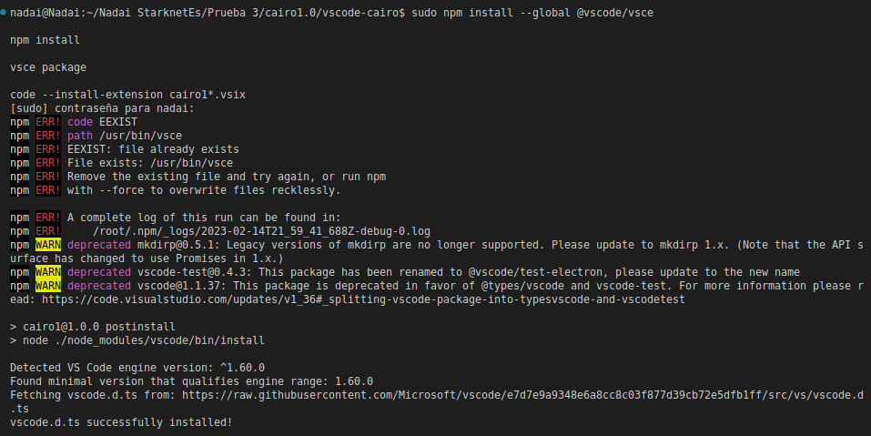
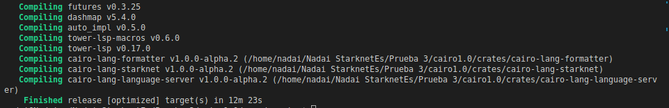
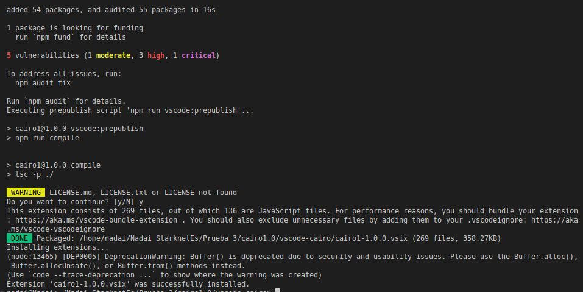
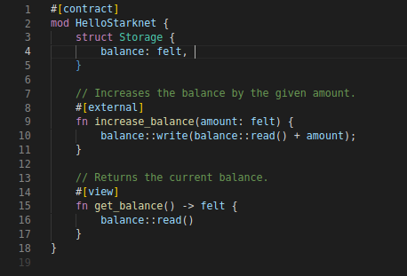
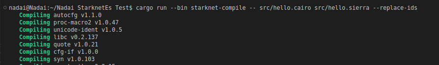
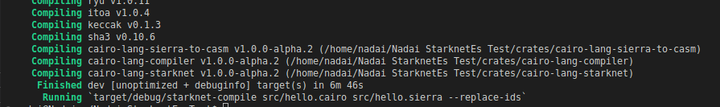
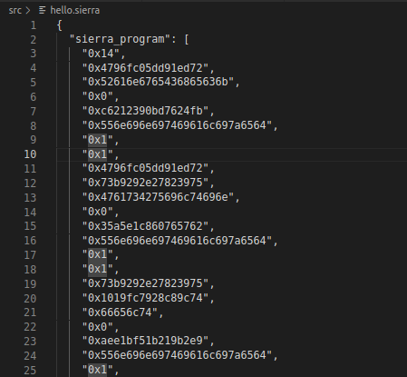
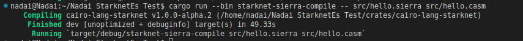

## Empezando con Cairo 1.0
En septiembre del año pasado, StarkWare hizo dos anuncios importantes que mejorarían significativamente la experiencia de los desarrolladores en la red. 

Fueron:

1. Cairo 1.0: Una enorme actualización de Cairo, el lenguaje de programación nativo de Starknet, que promete una experiencia de
   programación más segura, sencilla y mejor para los desarrolladores de Starknet. 

2. Sierra: Una capa de representación intermedia que ofrecerá mayor estabilidad a largo plazo para los programas Cairo.

La tediosa experiencia a la que se enfrentaban muchos desarrolladores a la hora de escribir código con versiones anteriores de Cairo será cosa del pasado, ya que Cairo 1.0 hace que escribir código sea significativamente más fácil y ordenado a medida que el lenguaje se asemeja a Rust. 

Este cambio en Cairo tiene la ventaja adicional de incorporar al ecosistema Starknet a nuevos desarrolladores familiarizados con Rust.

Por eso Cairo 1.0, con la introducción de Sierra, ha entusiasmado a la comunidad de desarrolladores de Starknet, y con razón. 

En este artículo, te enseñaremos cómo escribir y compilar tu primer contrato Cairo 1.0 y explorar todas las nuevas características que vienen con la mejora. Ahora, ¡entremos en materia! 

## Configurar un entorno de desarrollo
Antes de empezar a escribir nuestro código, necesitamos configurar un entorno de desarrollo. Desafortunadamente, las herramientas con las que puedes estar familiarizado para Starknet, como Protostar, Nile, o la CLI oficial de Starknet para desarrollo, actualmente no soportan Cairo 1.0. Eso significa que tendremos que usar una solución alternativa...

Hemos resuelto esto creando un:
- [Entorno de desarrollo personalizado para Cairo 1.0](https://github.com/Darlington02/cairo1.0) clonando y recortando el
 repositorio oficial. Necesitarás clonar este repositorio para escribir y compilar tu contrato Cairo 1.0.  
- [Nadai Entorno de desarrollo personalizado para Cairo 1.0]() clonando y recortando el
 repositorio oficial. Necesitarás clonar este repositorio para escribir y compilar tu contrato Cairo 1.0 con guías y algunos contratos extras.

¡[Graph]()

Todos nuestros contratos irán en la carpeta [src](src). Ya hemos creado un contrato boilerplate que compilaremos para sierra y casm en la siguiente sección de este artículo.

Una vez que hayamos clonado el repositorio, podemos activar nuestra extensión de código VS Cairo 1.0 para resaltar la sintaxis.

Para ello

1. Instala Node.js 18 LTS

2. Navega a la carpeta vscode-cairo

3. Ejecute los siguientes comandos en un terminal:

```bash
sudo npm install --global @vscode/vsce

npm install

vsce package

code --install-extension cairo1*.vsix
```



3. Construya el servidor de idiomas:

```bash
cargo build --bin cairo-language-server --release
```

, 


4. Abra Vscode en su directorio actual

Ejecuta estos comandos:

```bash
npm install

npm run compile
```




5. Finalmente, recarga VScode y pulsa F5 

PD: Deberías añadir este fragmento extra a tu archivo settings.json en VScode para asegurarte de que las cosas se ejecutan correctamente.

```bash
"cairo1.languageServerPath": "/Some/Path/target/release/cairo-language-server",
```
, ,

Si tu instalación fue exitosa, dirígete a src/hello.cairo, y deberías tener el resaltado de sintaxis activado, como se ve en la imagen de arriba.

## Compilando tu primer contrato Cairo 1.0
Una vez configurado nuestro entorno de desarrollo, podemos pasar a compilar nuestro contrato de Cairo 1.0.

Trabajaremos con un contrato sencillo localizado en src/hello.cairo 

```cairo
#[contract]

mod HelloStarknet {

   struct Storage {

       balance: felt,

   }

   #[external]

   fn increase_balance(amount: felt) {

       balance::write(balance::read() + amount);

   }

   #[view]

   fn get_balance() -> felt {

       balance::read()

   }

}
```

Este contrato implementa funciones simples para incrementar y obtener la variable saldo. El #[contract] significa que estamos escribiendo un contrato Starknet en lugar de un programa Cairo.

A diferencia de los contratos 0.x, donde compilamos directamente a ensamblador Cairo (casm), con Cairo 1.0, la compilación de nuestros contratos se hará en dos etapas:

1. Cairo > Sierra
2. Sierra > Casm

Sierra significa Safe Intermediate Representation (Representación Intermedia Segura) y pretende constituir una capa de representación entre los programas Cairo y sus bytecodes. Sierra abre la posibilidad de probar cada ejecución de Cairo, permitiendo así una robusta protección contra ataques de Denegación de Servicio (DoS).

Para compilar a Sierra, ejecute el siguiente comando:

```bash
cargo run --bin starknet-compile -- src/hello.cairo src/hello.sierra --replace-ids
```

, 

Si la compilación fue exitosa, debería ver la salida de Sierra en su src/hello.sierra.



Para seguir compilando de Sierra a Casm, ejecute el siguiente comando:

```bash
cargo run --bin starknet-sierra-compile -- src/hello.sierra src/hello.casm
```



Si la compilación fue exitosa, deberías ver la salida casm en tu src/hello.casm.


Starknet Alpha v0.11.0 no ha sido liberada, por lo que no podemos desplegar nuestros contratos compilados en testnet o mainnet. Sin embargo, se espera que esta actualización de la red se produzca a finales de febrero de 2023.

## Principales características de Cairo 1.0 que debes conocer 
Se necesitaría más que un solo artículo para repasar todas las nuevas características que vienen con Cairo 1.0, pero exploraremos algunas de las principales en esta sección:

### Una nueva sintaxis
Como se ha dicho antes, Cairo 1.0 viene con una sintaxis más limpia y mejorada inspirada en Rust. Esto incluye la adopción de características similares a Rust como traits y sus implementaciones, concordancia de patrones, panic, etc.

### Directivas de lenguaje e importaciones
Con Cairo 1.0, para empezar a escribir un contrato Starknet, tienes que especificar la macro:

```bash
#[contract]
```
También puede importar el "paquete" completo:

```bash
use starknet;
```

y úsalo así:

```bash
starknet::get_caller_address() 
```

### Tipos de datos
La firma del ecosistema de Starknet es el tipo de datos fieltro, y por supuesto, ¡no van a desaparecer pronto! 

Además del tipo de dato fieltro, hay soporte para otros tipos de Entero, como uint256, uint128, uint64, uint32, y uint8.

Aunque estos tipos Integer se implementan usando fieltros entre bastidores, se consideran más seguros de usar y ahora pueden soportar operaciones aritméticas sin necesidad de librerías personalizadas. p.e., ahora puedes realizar operaciones como:

```cairo
let sum = 1_uint128 + 2_uint128;

let product = 5_uint256 * 10_uint256;
```

El uso de estos operadores está protegido contra desbordamiento y causa pánico si se detecta un desbordamiento.

También hay soporte para un tipo de datos contractAddress similar al address de Solidity, que ha sido implementado recientemente en Cairo 0.1.

### Literales de tipo
Los literales numéricos como 1,2,3 son felt por defecto. Sin embargo, puede especificar un tipo de datos diferente para ellos añadiendo el tipo de datos, así:

```cairo
let num_uint256 = 1_uint256
```

### La palabra clave let para gobernarlos a todos
Con Cairo 1.0, finalmente eliminamos múltiples patrones de declaración de variables (tempvar, local, etc.) para abrazar sólo el uso de la palabra clave let.

Esto es muy útil ya que finalmente decimos adiós a los errores del compilador por referencias revocadas.

Ahora también puedes crear variables mutables utilizando la palabra clave mut.

### Estructuras y variables de almacenamiento
En lugar de utilizar el decorador @storage_var, Cairo 1.0 divide un contrato en tres secciones principales: una estructura de almacenamiento, los rasgos del contrato y sus implementaciones.

Todas las variables de almacenamiento están empaquetadas en una única estructura llamada Storage, aunque esto está sujeto a cambios. 

En el momento de escribir esto, esto es lo que parece:

```cairo
struct Storage {

   name: felt,

   symbol: felt,

   decimals: u8,

   total_supply: u256,

   balances: LegacyMap::<felt, u256>,

   allowances: LegacyMap::<(felt, felt), u256>,

}
```

Y puede leerse o escribirse de esta manera:

```cairo
let name = name::read()

let name = name::write(_name)
```

Los mapeos se pueden crear utilizando la palabra clave LegacyMap, donde los tipos de datos de las variables mapeadas se insertan entre < y > . También se pueden mapear tuplas.

## Eventos
Los eventos permiten a un contrato emitir información durante el curso de su ejecución que puede ser utilizada fuera de Starknet. 

Un evento puede crearse así:

```cairo
#[event]

fn Transfer(from_: felt, to: felt, value: u256) {}
```

Y posteriormente emitido de esta manera:

```cairo
Transfer(sender, recipient, amount);
```

## Funciones
Las funciones en Cairo 1.0 tienen un aspecto similar a las versiones 0.x, con la omisión de los argumentos implícitos y el cambio de la palabra clave func por fn siguiendo la convención de Rust. Aquí hay un ejemplo de una firma de función básica en Cairo 1.0:

```cairo
fn balance_of(account: felt) -> u256 {

   ...

}
```

También observará que las variables de retorno ya no contienen los nombres de las variables, sino sólo sus tipos de datos.

## Declaraciones de retorno
Al igual que en Rust, las funciones en Cairo 1.0 pueden devolver valores implícitamente omitiendo el punto y coma final de esta forma:

```cairo
#[view]

fn get_name() -> felt {

   name::read()

}
```

En este caso, la expresión final de la función se devuelve automáticamente, o explícitamente utilizando la palabra clave return, como en este caso:

```
#[view]

fn get_name() -> felt {

   return name::read();

}
```

## Decoradores
Los decoradores siguen existiendo en Cairo 1.0 pero con una nueva sintaxis similar a la de las macros de Rust. 

Puedes declarar un decorador así:

```cairo
#[external]
```
```cairo
#[view]
```

## Enumeraciones y concordancia de patrones
Los Enums son un tipo de dato especial que consiste en un conjunto fijo de constantes que usted define.

Puede crear un Enum en Cairo 1.0, así:

```cairo
enum Animals { Goat: felt, Dog: felt, Cat: felt }
```

Cairo 1.0 también nos permite crear emparejamientos de patrones similares a Rust usando la palabra clave match. Cuando se combinan con Enums, las coincidencias de patrones pueden permitirnos adaptar el comportamiento de una función dependiendo de la variante de datos que encuentre.

```cairo
enum Colors { Red: felt, Green: felt, Blue: felt }

func get_favorite_color() -> Colors {

   Colors::Green(0)

}

func main() -> felt {

   let my_color = get_favorite_color();

   let result = match my_color {

       Colors::Red(_) => {

           1

       },

       Colors::Green(_) => {

           2

       },

       Colors::Blue(_) => {

           3

       },

   };

   result // returns 2

}
```

## Array
Cairo 1.0 hace que la manipulación de matrices sea mucho más fácil, ya que la biblioteca principal exporta un tipo de matriz además de algunas funciones asociadas como append, array_at y array_len. Algunas operaciones básicas de array incluyen añadir nuevos elementos a un array existente, obtener el índice de un elemento, obtener la longitud del array, etc. Se puede acceder a ellas desde ArrayTrait.

```cairo
fn fib(n: usize) -> (Array::<felt>, felt, usize) {

   let mut arr = ArrayTrait::new();

   arr.append(1);

   arr.append(1);

   let mut arr = fib_inner(:n, :arr);

   let len = arr.len();

   let last = arr.at(len - 1_usize);

   return (arr, last, len);

}
```

## Mensajes de error y controles de acceso
Puede crear errores personalizados en Cairo, que se mostrarán al usuario en caso de fallo en la ejecución. Esto puede ser muy útil para implementar comprobaciones y mecanismos de control de acceso adecuados.

Con Cairo 1.0, puedes hacer esto fácilmente usando la sentencia assert en un patrón similar a la sentencia require en Solidity:

```cairo
assert(sender != 0, 'ERC20: transfer from 0');
```

El mensaje de error debe tener menos de 31 caracteres.

## Rasgos (Trait) y sus implementaciones
Cairo 1.0 introduce los rasgos y sus implementaciones. Piensa en los traits como un tipo especial de interfaz de contrato, ya que definen funcionalidades que un tipo particular tiene y puede compartir con otros. Se definen usando la palabra clave trait.

```cairo
trait IContract{

   fn set_something(num: felt, pair: felt);

   fn get_something(num: felt) -> felt;

}
```

Por otro lado, una implementación implementa comportamientos específicos del rasgo. Todas las funciones del rasgo deben definirse en la implementación. 

Se definen utilizando la palabra clave impl de la siguiente manera:

```cairo
impl Contract of IContract {

   fn set_something(num: felt, pair: felt) {

       number_pair::write(num, pair)

   }

   fn get_something(num: felt) -> felt {

       number_pair::read(num)

   }

}
```

## Genéricos
Cairo 1.0, similar a Rust, también soporta genéricos, lo que te permite escribir códigos que son flexibles y pueden trabajar con múltiples tipos en lugar de estar atados a un tipo específico.

Un parámetro de tipo se especifica como genérico mediante el uso de paréntesis angulares <> como este:

```cairo
fn foo<T>(arg: T) -> T {
    …
 }
```

## Reemplazar_class sysall
Con Cairo 1.0 y Starknet v0.11, se añadirá una nueva syscall, que te permitirá cambiar la implementación del contrato subyacente (hash de clase) sin cambiar el punto de entrada del contrato. ¡Piensa en un proxy por defecto! 

Y lo mejor es que puedes hacerlo utilizando una sola línea de código:

```cairo
#[contract]

mod upgradeable {
	use starknet::replace_class;
	
.	….

	#[external]
	fn upgradeable(cls_hash: felt) {
		replace_class(cls_hash);
	}
}
```

## Conclusión
Enhorabuena, ¡acaba de escribir y compilar su primer contrato Cairo 1.0 y ha aprendido sobre las características clave de Cairo 1.0! 

De nuevo, Cairo 1.0 es todavía un trabajo en progreso y evoluciona rápidamente. Cada día se añaden nuevas características, así que ¡consulte siempre el repositorio oficial y el canal de discusión de Discord para mantenerse al día!

Aquí tienes algunos recursos adicionales que creemos que te ayudarán en tu viaje a Cairo 0.10:

1. [A First Look at Cairo 1.0: A Safer, Stronger & Simpler Provable Programming Language](https://medium.com/nethermind-eth/a-first-look-at-cairo-1-0-a-safer-stronger-simpler-provable-programming-language-892ce4c07b38)
2. [Cairo 1.0 — changes, features, release date](https://extropy-io.medium.com/cairo-1-0-changes-features-release-date-15a266d7b919)
3.[https://github.com/starkware-libs/cairo/blob/main/docs/reference/src/SUMMARY.adoc](https://github.com/starkware-libs/cairo/blob/main/docs/reference/src/SUMMARY.adoc)
4. [https://github.com/argentlabs/starknet-build/tree/main/cairo1.0/examples](https://github.com/argentlabs/starknet-build/tree/main/cairo1.0/examples)
5. [Cairo 1.0 by StarkWare](https://medium.com/starkware/cairo-1-0-aa96eefb19a0#:~:text=Introducing%20Sierra%3A%20ensuring%20every%20Cairo%20run%20can%20be%20proven)

